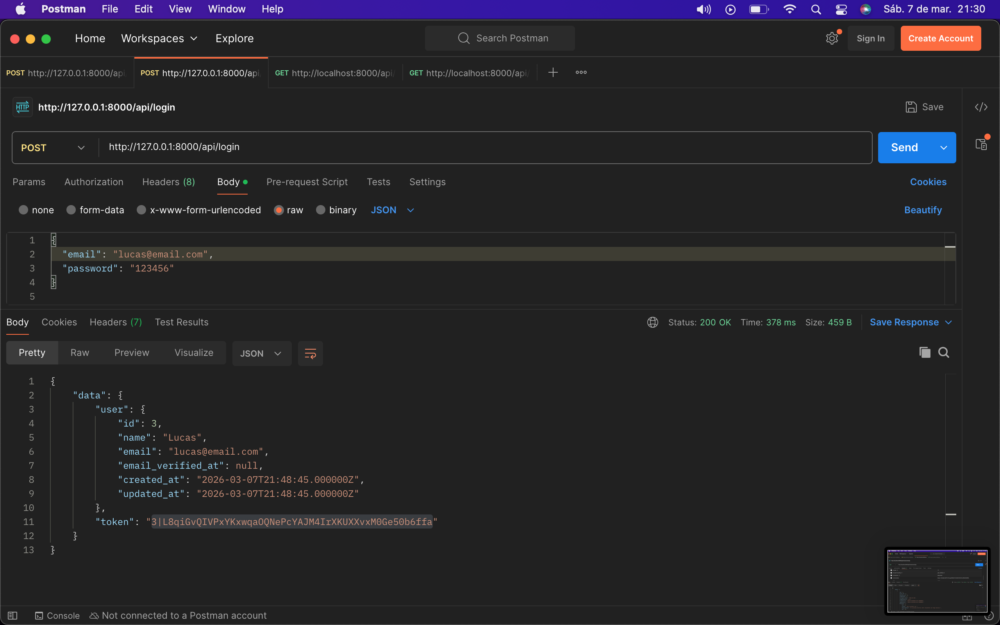
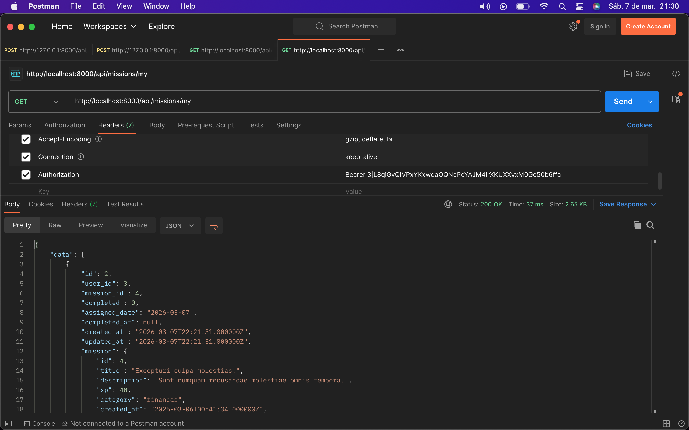
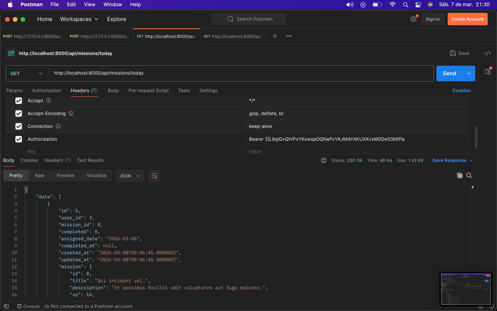

# Silva API

API backend para o sistema **Silva**, responsável por **autenticação de usuários** e **gerenciamento de missões**.

A API foi desenvolvida utilizando **Laravel** e **Laravel Sanctum** para autenticação via token.

---

# Tecnologias

* PHP
* Laravel
* MySQL
* Laravel Sanctum

---

# Instalação

Clone o repositório:

```bash
git clone https://github.com/seu-usuario/silva-api.git
cd silva-api
```

Instale as dependências:

```bash
composer install
```

Copie o arquivo de ambiente:

```bash
cp .env.example .env
```

Configure seu banco de dados no arquivo `.env`.

Gere a chave da aplicação:

```bash
php artisan key:generate
```

Execute as migrations:

```bash
php artisan migrate
```

Inicie o servidor:

```bash
php artisan serve
```

A API estará disponível em:

```
http://127.0.0.1:8000
```

---

# Autenticação

A API utiliza **Laravel Sanctum** com autenticação via **Bearer Token**.

Após realizar **login** ou **registro**, a API retorna um token que deve ser enviado no header das requisições protegidas:

```
Authorization: Bearer SEU_TOKEN
```

---

# Rotas principais

### POST /api/register — Registrar usuário


---

### POST /api/login — Login do usuário



---

### GET /api/missions — Lista todas as missões


---

### GET /api/missions/my — Lista todas as missões do usuário



---

### GET /api/missions/today — Lista todas as missões do dia do usuário



---

# Autor

Desenvolvido por **Kayque Silva**
