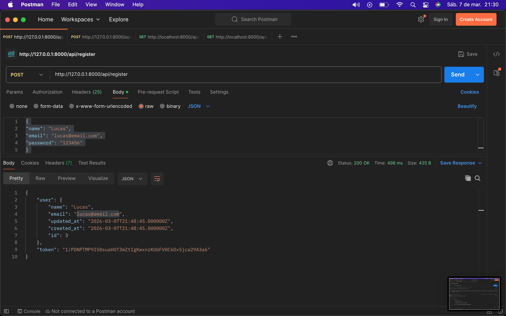
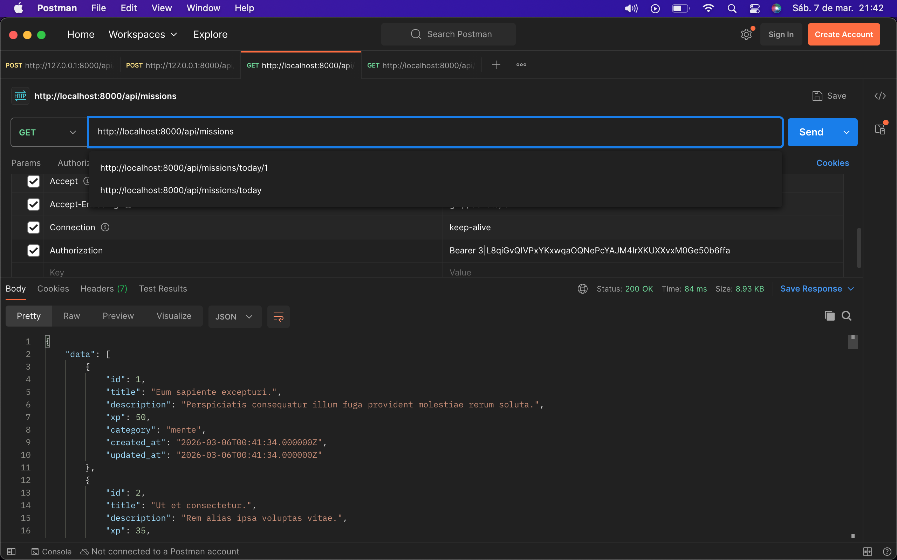

# Silva API

API backend para o sistema **Silva**, responsável por **autenticação de usuários** e **gerenciamento de missões**.

A API foi desenvolvida utilizando **Laravel** e **Laravel Sanctum** para autenticação via token.

---

# Tecnologias

- PHP
- Laravel
- MySQL
- Laravel Sanctum

---

# Instalação

Clone o repositório:

```bash
git clone https://github.com/seu-usuario/silva-api.git
cd silva-api

Instale as dependências:

composer install


Copie o arquivo de ambiente:

cp .env.example .env


Configure seu banco de dados no arquivo .env.

Gere a chave da aplicação:

php artisan key:generate


Execute as migrations:

php artisan migrate


Inicie o servidor:

php artisan serve


A API estará disponível em:

http://127.0.0.1:8000

Autenticação

A API utiliza Laravel Sanctum com autenticação via Bearer Token.

Após realizar login ou registro, a API retorna um token que deve ser enviado no header das requisições protegidas:

Authorization: Bearer SEU_TOKEN

Rotas principais
Método	Rota	Descrição
POST	/api/register	    Registrar usuário


POST	/api/login	        Login do usuário


GET	    /api/missions	    Lista todas as missões


GET	    /api/missions/my    Lista todas as missões do usuário


GET	    /api/missions/today    Lista todas as missões do dia do usuário


Autor

Desenvolvido por Kayque Silva